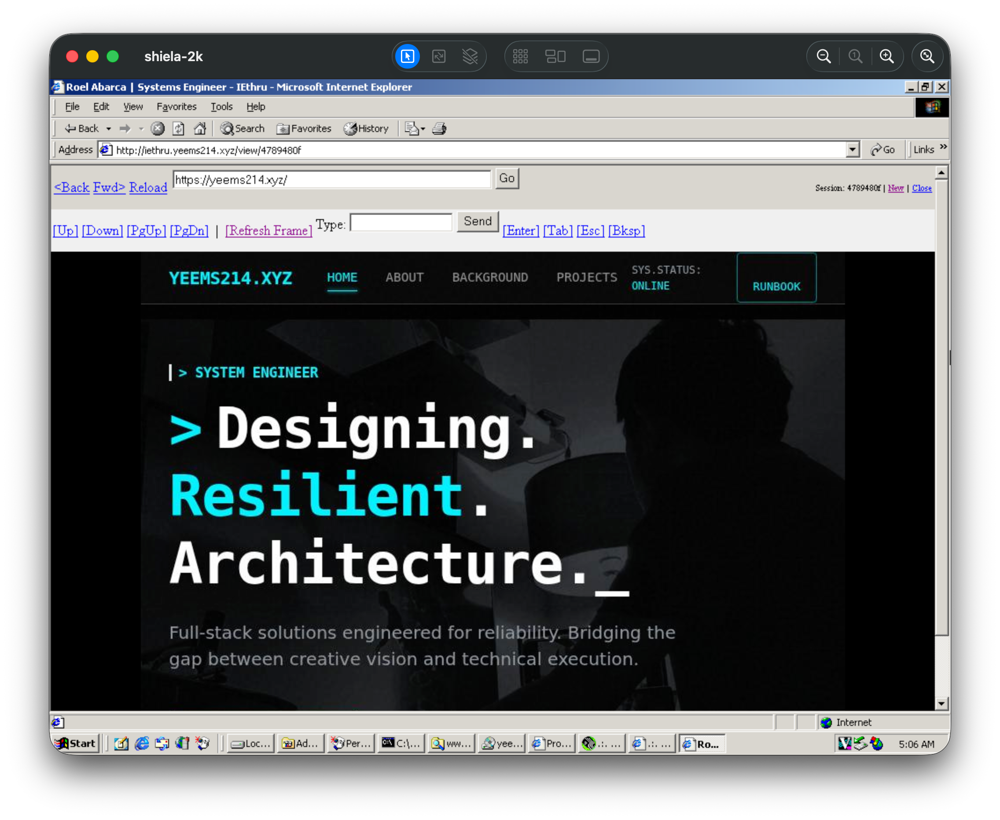

# IEthru

**Browse the modern web on Internet Explorer 5/6**

IEthru is a remote browser proxy that lets legacy browsers (IE5/6 on Windows 2000/XP) access modern HTTPS websites through server-side rendering. The server runs a headless Chromium browser, captures screenshots, and streams them to the legacy client.



## Features

- [ ] **IE5/6 Compatible** - Pure HTML 4.01, table layouts, no modern JS
- [ ] **Screenshot Streaming** - JPEG frames with configurable quality
- [ ] **Full Interactivity** - Click, scroll, type, keyboard shortcuts
- [ ] **HTTPS Support** - Access modern TLS 1.3 sites through proxy
- [ ] **Docker Ready** - One command deployment
- [ ] **Cloudflare Tunnel** - Optional secure public access

## Quick Start

### Docker (Recommended)

```bash
# Clone the repository
git clone https://github.com/yourusername/iethru.git
cd iethru

# Start with Docker Compose
docker compose up -d

# Access at http://localhost:5001
```

### Manual Installation

```bash
# Install Python dependencies
pip install -r requirements.txt

# Install Playwright browsers
playwright install chromium
playwright install-deps chromium

# Run the server
python app.py
```

## Requirements

### System Requirements

- Python 3.9+
- 2GB RAM minimum (4GB recommended)
- Docker (for containerized deployment)

### Python Dependencies

```
Flask>=2.3.0
playwright>=1.40.0
Pillow>=10.0.0
```

### Client Requirements

- Internet Explorer 5.0+ (Windows 2000/XP)
- Or any browser for testing

## Configuration

Edit `config.py` to customize:

| Setting                   | Default | Description                 |
| ------------------------- | ------- | --------------------------- |
| `DEFAULT_VIEWPORT_WIDTH`  | 800     | Browser viewport width      |
| `DEFAULT_VIEWPORT_HEIGHT` | 600     | Browser viewport height     |
| `DEFAULT_QUALITY`         | 60      | JPEG quality (1-100)        |
| `DEFAULT_FPS`             | 5       | Frame rate for streaming    |
| `SESSION_TIMEOUT_SECONDS` | 300     | Session expiry time         |
| `MAX_SESSIONS`            | 10      | Maximum concurrent sessions |

## Docker Deployment

### Using Docker Compose (Recommended)

```yaml
# docker-compose.yml
version: "3.8"
services:
  iethru:
    build: .
    ports:
      - "5001:5000"
    environment:
      - APP_HOST=0.0.0.0
      - APP_PORT=5000
    shm_size: "2gb"
    security_opt:
      - seccomp=unconfined
    restart: unless-stopped
```

```bash
# Build and start
docker compose up -d

# View logs
docker logs iethru -f

# Stop
docker compose down
```

### Using Docker CLI

```bash
# Build image
docker build -t iethru .

# Run container
docker run -d \
  --name iethru \
  -p 5001:5000 \
  --shm-size=2gb \
  --security-opt seccomp=unconfined \
  iethru
```

### Important Docker Notes

- **`shm_size: 2gb`** - Required for Chromium to work properly
- **`seccomp=unconfined`** - Needed for Playwright sandboxing
- The container exposes port 5000 internally

## Cloudflare Tunnel Deployment

Expose IEthru securely to the internet using Cloudflare Argo Tunnel (now called Cloudflare Tunnel).

### Prerequisites

1. A Cloudflare account (free tier works)
2. A domain added to Cloudflare
3. `cloudflared` CLI installed

### Setup Steps

#### 1. Install cloudflared

```bash
# macOS
brew install cloudflared

# Linux (Debian/Ubuntu)
curl -L https://github.com/cloudflare/cloudflared/releases/latest/download/cloudflared-linux-amd64.deb -o cloudflared.deb
sudo dpkg -i cloudflared.deb

# Windows
# Download from https://github.com/cloudflare/cloudflared/releases
```

#### 2. Authenticate with Cloudflare

```bash
cloudflared tunnel login
```

This opens a browser to authorize access to your Cloudflare account.

#### 3. Create a Tunnel

```bash
# Create tunnel
cloudflared tunnel create iethru

# This outputs a Tunnel ID like: a1b2c3d4-e5f6-7890-abcd-ef1234567890
```

#### 4. Configure the Tunnel

Create `~/.cloudflared/config.yml`:

```yaml
tunnel: a1b2c3d4-e5f6-7890-abcd-ef1234567890
credentials-file: /path/to/.cloudflared/a1b2c3d4-e5f6-7890-abcd-ef1234567890.json

ingress:
  - hostname: iethru.yourdomain.com
    service: http://localhost:5001
  - service: http_status:404
```

#### 5. Create DNS Record

```bash
cloudflared tunnel route dns iethru iethru.yourdomain.com
```

#### 6. Run the Tunnel

```bash
# Start tunnel (foreground)
cloudflared tunnel run iethru

# Or run as a service
sudo cloudflared service install
sudo systemctl start cloudflared
```

### Docker + Cloudflare Tunnel

Add cloudflared to your Docker Compose:

```yaml
version: "3.8"
services:
  iethru:
    build: .
    ports:
      - "5001:5000"
    shm_size: "2gb"
    security_opt:
      - seccomp=unconfined
    restart: unless-stopped

  cloudflared:
    image: cloudflare/cloudflared:latest
    command: tunnel --no-autoupdate run --token YOUR_TUNNEL_TOKEN
    restart: unless-stopped
    depends_on:
      - iethru
```

Get your tunnel token from the Cloudflare Zero Trust dashboard.

## Usage

### Home Page

Navigate to `http://your-server:5001` to see the home page with quick links.

### Controls

| Control                   | Action              |
| ------------------------- | ------------------- |
| `[Up]` `[Down]`           | Scroll page up/down |
| `[PgUp]` `[PgDn]`         | Page up/down        |
| `[Refresh Frame]`         | Update screenshot   |
| Click on image            | Click element       |
| Type box + Send           | Type text           |
| `[Enter]` `[Tab]` `[Esc]` | Press keys          |
| `<Back` `Fwd>`            | Navigate history    |
| `Reload`                  | Refresh page        |

### URL Bar

Enter any URL and click "Go" to navigate.

## API Endpoints

| Endpoint               | Method   | Description     |
| ---------------------- | -------- | --------------- |
| `/`                    | GET      | Home page       |
| `/browse`              | GET/POST | Navigate to URL |
| `/view/<session_id>`   | GET      | View session    |
| `/frame/<session_id>`  | GET      | Get JPEG frame  |
| `/scroll/<session_id>` | GET      | Scroll page     |
| `/click/<session_id>`  | GET      | Click at coords |
| `/type/<session_id>`   | GET      | Type text       |
| `/key/<session_id>`    | GET      | Press key       |
| `/stream/<session_id>` | GET      | MJPEG stream    |

## Architecture

```
┌─────────────────┐      ┌──────────────────┐      ┌─────────────────┐
│   IE5/6 Client  │──────│   IEthru Server  │──────│  Modern Website │
│  (Windows 2000) │ HTTP │  (Flask+Playwright)│ HTTPS│  (TLS 1.3, JS)  │
└─────────────────┘      └──────────────────┘      └─────────────────┘
        │                        │
        │  1. Request URL        │
        │───────────────────────>│
        │                        │  2. Render page
        │                        │  with Chromium
        │  3. JPEG screenshot    │
        │<───────────────────────│
        │                        │
        │  4. Click/scroll/type  │
        │───────────────────────>│
        │                        │  5. Execute action
        │  6. Updated screenshot │
        │<───────────────────────│
```

## Troubleshooting

### Session keeps resetting

- Check that your browser accepts cookies
- Ensure the session_id is in the URL

### Black/blank viewport

- Wait for page to fully load
- Try clicking [Refresh Frame]
- Check server logs for errors

### Docker container crashes

- Ensure `shm_size: 2gb` is set
- Add `seccomp=unconfined` security option
- Check available memory

### Cloudflare tunnel not connecting

- Verify tunnel is running: `cloudflared tunnel info iethru`
- Check DNS record exists
- Ensure config.yml has correct tunnel ID

## License

MIT License - See [LICENSE](LICENSE) for details.

## Credits

- [Playwright](https://playwright.dev/) - Browser automation
- [Flask](https://flask.palletsprojects.com/) - Web framework
- [Pillow](https://pillow.readthedocs.io/) - Image processing

---

Made with ❤️ for retro computing enthusiasts
